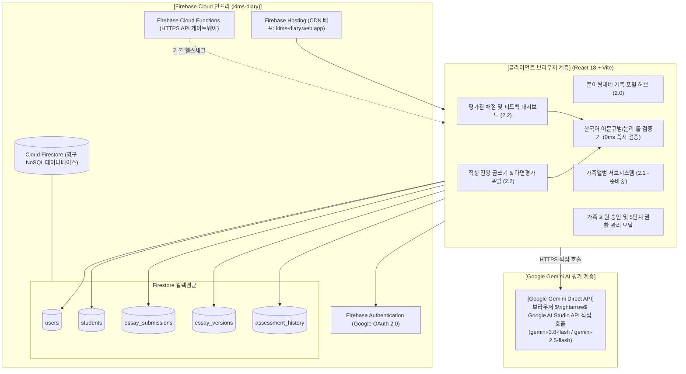
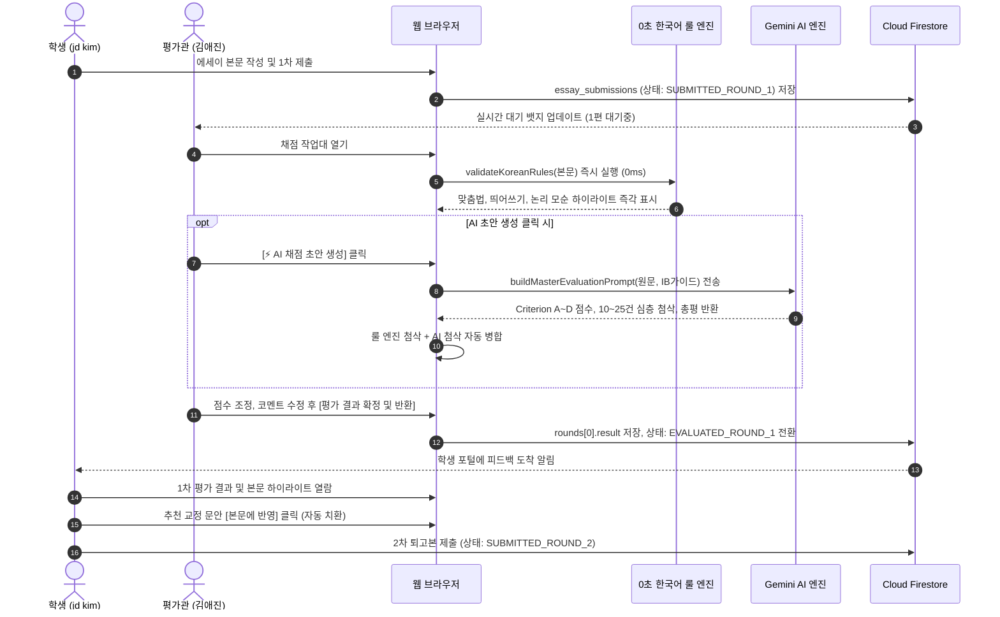

# 01. 전체 시스템 아키텍처 및 하이브리드 파이프라인
## (System Architecture & Hybrid AI Pipeline)

---

## 1. 개요 및 설계 철학

**쭌이형제네 가족 통합 포털**은 가족 구성원의 일상 기록 및 아이들의 국제 바칼로레아(IB) 서술형 글쓰기 다면평가를 지원하는 올인원 웹 애플리케이션입니다.
본 시스템은 **Firebase 클라우드 인프라(글로벌 고가용성 호스팅, Google 인증, 실시간 NoSQL 데이터베이스)**와 **사용자 홈서버 / Google Gemini AI 모델**을 유기적으로 연계하는 **하이브리드 아키텍처**로 설계되었습니다.

---

## 2. 전체 아키텍처 다이어그램

---

## 3. 서브시스템 분할 체계

| 서브시스템 식별자 | 명칭 | 상태 | 주요 역할 및 기능 |
| :--- | :--- | :---: | :--- |
| **서브시스템 2.0** | **가족 통합 포털 허브 (`hub`)** | **운영 중** | • 로그인 상태별 환영 배너 및 실시간 AI 헬스체크 배지 • 서브시스템(앨범, 다면평가) 바로가기 카드 • 권한별 빠른 관리(학생 관리, 회원 승인 관리, 포트폴리오) |
| **서브시스템 2.1** | **가족앨범 시스템 (`album`)** | **준비 중** | • 아이별 일상 성장 타임라인 및 사진 영구 보관 • 가족 캘린더 및 기념일 앨범 연동 로드맵 |
| **서브시스템 2.2** | **IB 서술형 다면평가 시스템 (`ib_assessment`)** | **운영 중** | • **학생 포털**: 에세이 1차 제출, 심사 대기, 첨삭 확인, 2차 퇴고 요청 • **평가관 대시보드**: 학생별 제출 리스트, 채점 작업대, 4대 준거 루브릭 점수 부여, 총평 반환 • **누적 성장 포트폴리오**: 회차별 점수 향상 추이 및 레이더 차트 |

---

## 4. Google Gemini 실시간 AI 다면평가 파이프라인

에세이 평가는 복잡한 외부 서버 종속성 없이 브라우저에서 Google 최신 Gemini Flash 모델을 직접 호출하여 고속 처리합니다:

* **작동 방식**: 브라우저 클라이언트에서 Google Gemini API(`generativelanguage.googleapis.com`)를 직접 호출.
* **장점**:
  * 별도의 홈서버 구동, 포트포워딩, 외부 터널링 없이 인터넷만 연결되어 있으면 전 세계 어디서나 즉시 평가 가능.
  * 최신 플래그십 모델(`gemini-3.8-flash`, `gemini-2.5-flash`)을 실시간 활용하여 IB 4대 루브릭 준거 채점 및 전 구간 정밀 인라인 첨삭 수행.
* **보안 및 키 관리**:
  * 관리자가 상단 헤더의 `[AI 설정]` 모달에서 API 키를 등록하거나 환경 변수(`VITE_GEMINI_API_KEY`)를 통해 주입.
  * 학생 계정에게는 API 키 및 모델 설정 화면이 은닉(OFF)되어 안전하게 보호.

---

## 5. 실시간 동기식 에세이 평가 파이프라인 흐름

