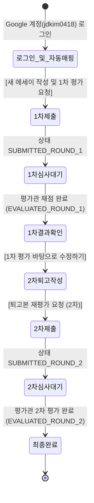
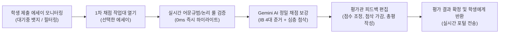

# 02. 역할별 권한 매트릭스 및 포털 상호작용 워크플로
## (Role-Based Workflow & Permissions Matrix)

---

## 1. 5단계 사용자 권한 계층 구조

본 시스템은 가족 구성원의 역할과 접근 범위를 명확히 분리하기 위해 5단계 권한 체계를 지원합니다:

| 역할 코드 | 권한 명칭 | 배지 표시 | 권한 범위 및 주요 책임 |
| :---: | :---: | :---: | :--- |
| `super_admin` | **최고관리자** | 보라색 (`최고관리자`) | • **시스템 전권**: 모든 서브시스템, 회원 승인, 모든 권한 부여 가능 • 시스템 보호를 위해 최고관리자 본인의 권한은 스스로 강등 불가 |
| `admin` | **일반관리자** | 남색 (`관리자`) | • **가족 운영 총괄**: 회원 승인, 평가자/학생 권한 부여 • 제약: 최고관리자의 권한을 변경할 수 없으며 타인을 최고관리자로 승격 불가 |
| `evaluator` | **평가관 (교사)** | 하늘색 (`평가자`) | • **에세이 채점 대시보드**: 학생별 제출 에세이 조회, 채점 작업대 사용 • IB 4대 준거 점수 부여, 총평/첨삭 피드백 반환 • 학생 모드 전환 버튼을 통해 본인도 글쓰기 가능 (학생 프로필 등록 필요) |
| `student` | **평가대상자 (학생)** | 초록색 (`가족 회원`) | • **학생 전용 글쓰기 포털**: 본인 작성 글 제출(1차) 및 퇴고 요청(2차) • **엄격한 1:1 계정 바인딩**: 타 학생의 글이나 프로필 조회/변경 불가 • 본인 누적 성장 분석(포트폴리오) 열람 |
| `pending` | **가입 승인 대기자** | 황색 (`가입 승인 대기`) | • 구글 로그인 후 최초 상태: 관리자 승인 전까지 포털 접근 차단 대기 화면 표시 |

---

## 2. 학생(Student) 상호작용 워크플로

학생 사용자는 복잡한 채점 도구 없이 **'글쓰기 $\rightarrow$ 피드백 확인 $\rightarrow$ 퇴고'**에만 집중할 수 있는 전용 포털을 이용합니다.

### 1) 계정 1:1 강제 바인딩 (Auto-binding)
* 학생 계정 로그인 시, `students` 컬렉션에서 `googleEmail === userProfile.email` 또는 `googleUid` 또는 `name`을 1:1 매칭합니다.
* 등록된 프로필이 없을 경우 본인 계정 정보로 신규 학생 프로필을 자동 등록하여 바인딩합니다.
* **절대 다른 학생의 프로필을 임의로 가져오거나 변경할 수 없습니다.**

### 2) 1차 에세이 작성 및 제출
* 제목, 대상 IB 단계(PYP/MYP/DP) 및 학년, 에세이 본문, 학생 메모를 입력하고 `[새 에세이 작성 및 1차 평가 요청]`을 제출합니다.

### 3) 1차 평가 결과 열람 및 인라인 첨삭 확인
* 평가관이 채점을 마치면 학생 포털에 점수(32점 만점)와 총평이 도착합니다.
* 좌측 본문 뷰어(`AnnotatedEssayViewer`)에 평가관이 지정한 **맞춤법(Rose), 논리 모순(Amber), 통찰(Emerald)** 하이라이트가 시각적으로 표시됩니다.

### 4) 원클릭 퇴고 및 2차 재평가 요청
* `[1차 평가 바탕으로 수정하기]` 클릭 시 2차 퇴고 모드로 진입합니다.
* 우측 첨삭 목록에서 `[본문에 반영]` 버튼을 누르면 추천 수정 문안이 본문 텍스트에 즉시 자동 치환 적용됩니다.
* 수정한 내용과 퇴고 소감을 적고 `[퇴고본 재평가 요청 (2차)]`을 제출합니다.

---

## 3. 평가관(Evaluator) 상호작용 워크플로

평가관은 학생이 제출한 에세이 목록을 모니터링하고 전문적인 채점 및 지도를 수행합니다.

1. **에세이 목록 조회**:
   * `전체`, `1차 평가 대기중`, `1차 평가 완료`, `2차 평가 대기중`, `최종 완료` 탭별로 에세이를 체계적으로 필터링.
2. **채점 작업대 (3대 탭 워크스페이스)**:
   * **좌측 창**: 학생 에세이 본문에 오탈자, 띄어쓰기, 논리 모순이 즉시 하이라이트되어 가시화.
   * **우측 창**:
     * `[인라인 첨삭]`: 전체/맞춤법/논리/통찰 필터링, 개별 첨삭 확인, 불필요한 첨삭 삭제(`휴지통`), `+ 직접 첨삭 추가`.
     * `[IB 4대 준거 루브릭]`: Criterion A(분석), B(구성), C(생산), D(언어) 1~8점 슬라이더 조정.
     * `[총평 & 조언]`: 지도 조언, Warm Feedback(칭찬), Cool Feedback(도전 과제) 작성.
3. **평가 결과 확정 및 반환**:
   * `[평가 결과 확정 및 학생에게 반환하기]`를 누르면 즉시 학생 포털로 평가 데이터가 전송됩니다.

---

## 4. 권한별 화면 요소 가시성(ON/OFF) 총괄 매트릭스

| 화면 영역 | UI 컴포넌트 / 기능 버튼 | 학생 계정 (`student`) | 평가관 (`evaluator`) | 관리자 (`admin` / `super_admin`) |
| :--- | :--- | :---: | :---: | :---: |
| **상단 헤더 (Header)** | 포털 브랜드 (`쭌이형제네 가족 포털`) | **ON** | **ON** | **ON** |
| | 서브시스템 네비게이션 (`포털 홈`, `가족앨범`, `IB 다면평가`) | **ON** | **ON** | **ON** |
| | 학생 전환 드롭다운 알약 (`김애진 IB DP v`) | **OFF (은닉)** | **ON** | **ON** |
| | IB 단계 탭 (`PYP / MYP / DP`) | **OFF (은닉)** | **ON** | **ON** |
| | 채점 가이드 & 원본 설정 (`SlidersHorizontal`) | **OFF (은닉)** | **ON** | **ON** |
| | 누적 성장 분석 대시보드 (`성장 분석`) | **ON (본인 성적)** | **ON (전체/학생별)** | **ON (전체/학생별)** |
| | AI 홈서버 / Gemini 설정 (`AI 설정`) | **OFF (은닉)** | **ON** | **ON** |
| | 평가자 $\leftrightarrow$ 학생 모드 전환 버튼 (`Edit3`) | **OFF** | **ON** | **ON** |
| | 구글 프로필 메뉴 $\rightarrow$ 회원 승인 / 권한 관리 | **OFF** | **OFF** | **ON** |
| **포털 허브 (Hub)** | 환영 배너 및 로그인 상태 배지 | **ON** | **ON** | **ON** |
| | 가족 등록 학생 수 통계 클릭 (학생 관리 모달) | **OFF (텍스트만)** | **ON (모달 열림)** | **ON (모달 열림)** |
| | 빠른 관리: `회원 승인 / 권한 관리` 버튼 | **OFF** | **OFF** | **ON** |
| | 빠른 관리: `가족 학생 관리` 버튼 | **OFF** | **ON** | **ON** |
| | 빠른 관리: `성장 분석 대시보드` 버튼 | **ON** | **ON** | **ON** |
| **학생 포털 (StudentView)** | 작성자 표시 | **본인 계정 이름** | **선택 학생 이름** | **선택 학생 이름** |
| | `[학생 변경]` 버튼 | **OFF (은닉)** | **ON (학생 모드 시)** | **ON (학생 모드 시)** |
| | 새 에세이 작성 및 1차 평가 요청 | **ON** | **ON (학생 모드 시)** | **ON (학생 모드 시)** |
| | 1차 평가 확인 및 2차 퇴고 요청 | **ON** | **ON (학생 모드 시)** | **ON (학생 모드 시)** |
| | 추천 문안 원클릭 `[본문에 반영]` 치환 | **ON** | **ON (학생 모드 시)** | **ON (학생 모드 시)** |
| **평가관 대시보드 (EvaluatorView)** | 학생별 제출 에세이 큐 모니터링 | **접근 불가** | **ON** | **ON** |
| | 1차/2차 채점 작업대 열기 | **접근 불가** | **ON** | **ON** |
| | 0초 한국어 어문규범/논리 룰 검증 | **접근 불가** | **ON (자동)** | **ON (자동)** |
| | Gemini AI 채점 초안 자동 생성 | **접근 불가** | **ON** | **ON** |
| | 준거 점수 부여 및 학생에게 피드백 반환 | **접근 불가** | **ON** | **ON** |
| | 제출물 강제 삭제 (`Trash2`) | **접근 불가** | **ON** | **ON** |
