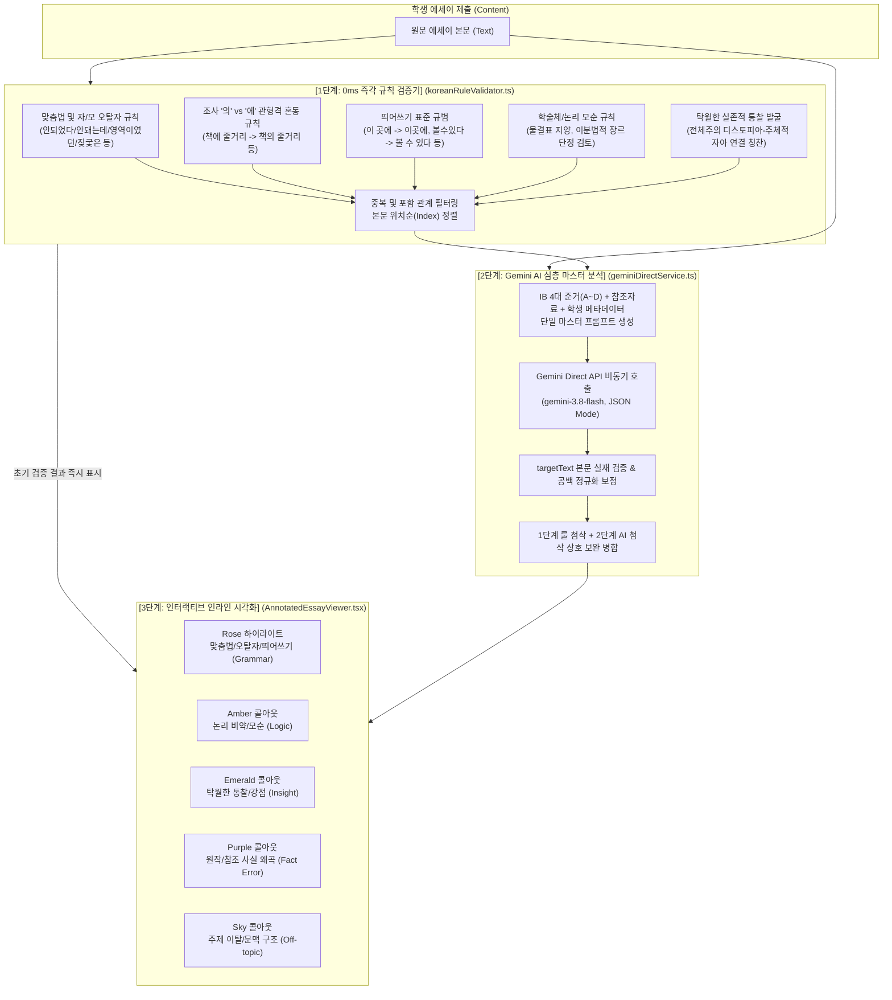

# 03. 한국어 어문 규범/논리 검증 엔진 & Gemini AI 다면평가 파이프라인
## (Korean Rule Engine & Gemini AI Multi-Dimensional Pipeline)

---

## 1. 개요 및 하이브리드 검증 아키텍처

쭌이형제네 IB 다면평가 시스템(서브시스템 2.2)은 **'결정론적 규칙 검증(Deterministic Rule Validation)'**과 **'대규모 생성형 AI 심층 분석(Deep Generative AI Evaluation)'**을 상호 보완적으로 결합한 **이중 검증 파이프라인**을 운영합니다.



---

## 2. 1단계: 한국어 어문 규범 및 논리 룰 검증기 (`koreanRuleValidator.ts`)

인터넷 연결 지연이나 AI 토큰 비용 없이 학생 에세이가 로드되는 즉시 **0ms** 만에 한국어 표준 어문 규범과 논증 기본기를 전수 스캔합니다.

### 2.1 5대 검증 카테고리 및 핵심 규칙 목록

| 카테고리 | 검출 정규식/패턴 (`pattern`) | 유형 (`type`) | 검출 사유 및 피드백 (`comment`) | 추천 교정안 (`suggestion`) |
| :--- | :--- | :---: | :--- | :--- |
| **맞춤법 / 오탈자** | `/안되었다/g` | `grammar` | 부정 부사 '안'은 띄어 쓰거나 준말 '안됐다'로 표기해야 함 | `안 되었다` |
| | `/안돼는데/g` | `grammar` | 연결어미 '-는데' 앞에서는 어간 '되-'가 쓰여야 함 | `안 되는데` |
| | `/안되서/g` | `grammar` | '되어서'의 준말은 '돼서' | `안 돼서` |
| | `/안됌/g` | `grammar` | 자음 명사형 어미 결합 시 '안 됨'으로 표기 | `안 됨` |
| | `/영역이였던/g` | `grammar` | 서술격 조사 '이다'의 과거 시제는 '이었던' | `영역이었던` |
| | `/되므로써/g` | `grammar` | 수단/도구 격조사는 '-ㅁ/음으로써' | `됨으로써` |
| | `/먹엇다/g`, `/되엇다/g` | `grammar` | 과거 시제 선어말어미는 쌍시옷('-었-') | `먹었다`, `되었다` |
| | `/삼람들은/g`, `/아리들/g` | `grammar` | 자음/모음 타이핑 오탈자 | `사람들은`, `아이들` |
| | `/짖궃은/g` | `grammar` | '짓궂다'의 올바른 활용형 규범 | `짓궂은` |
| | `/떄문에/g`, `/3학년떄/g` | `grammar` | 의존명사 띄어쓰기 및 모음 오타 | `때문에`, `3학년 때` |
| | `/문단이 끝나면 두 칸.../g` | `offtopic` | 원고지 작성 요령 지시문 잔존 제거 안내 | `(삭제)` |
| **조사 '의' vs '에'** | `/책에 줄거리/g` | `grammar` | 뒷말 '줄거리'를 수식하는 관형격 관계 | `책의 줄거리` |
| | `/자신에 사물함/g` | `grammar` | 소유 및 관형격 조사 '의' 사용 | `자신의 사물함` |
| | `/최\.?악\.?에 의사/g` | `grammar` | 관형격 조사 '의' 올바른 결합 | `최악의 의사` |
| **띄어쓰기 규범** | `/이 곳에/g`, `/그 곳에/g`, `/저 곳에/g` | `grammar` | '이곳', '그곳', '저곳'은 합성 대명사이므로 붙여 씀 | `이곳에`, `그곳에`, `저곳에` |
| | `/않다보니/g` | `grammar` | 연결어미 뒤 보조용언 '보다' 띄어쓰기 원칙 | `않다 보니` |
| | `/SF\s+보다는/g` | `grammar` | 조사 '보다는'은 앞의 체언에 붙여 씀 | `SF보다는` |
| | `/[볼할알]수있다/g` | `grammar` | 의존명사 '수'는 앞말과 띄어 씀 | `볼 수 있다` 등 |
| | `/[학습한있는하는]것/g` | `grammar` | 관형사형 어미 뒤 의존명사 '것' 띄어 씀 | `학습한 것` 등 |
| | `/소설\.\s*1984이다/g` | `grammar` | 마침표 뒤 서술격 조사 직결 호응 부자연 | `소설, 바로 1984이다` |
| **논리 / 문맥 비판** | `/SF\s*보다는\s*사회주의\s*성격의\s*소설이다/g` | `logic` | SF 디스토피아 설정과 전체주의 비판의 상호 배타성 지양 | `SF라는 장르적 장치를 활용하여 전체주의의 위험성을 고발한 소설이다` |
| | `/많~+이/g` | `logic` | 논증 에세이 내 부적합 물결표/채팅체 정비 | `매우 많이` |
| **탁월한 통찰 (칭찬)** | `/자신의\s*정체성을\s*붙들지\s*않으면.../g` | `insight` | 디스토피아 경고를 현대인의 실존적 정체성 상실로 확장한 성찰 | *(칭찬 코멘트 배정)* |
| | `/우리는\s*지금\s*모두\s*이\s*사회가.../g` | `insight` | 허구의 시공간을 현대 제도의 구속으로 메타인지화한 시각 | *(칭찬 코멘트 배정)* |

### 2.2 엔진 실행 및 중복 제거 알고리즘 (`validateKoreanRules`)

```typescript
export function validateKoreanRules(content: string): InlineAnnotation[] {
  if (!content || !content.trim()) return [];

  const annotations: InlineAnnotation[] = [];
  let idCounter = 1;

  for (const rule of KOREAN_RULES) {
    // String 및 RegExp에 따른 전수 위치 탐색
    // ...
  }

  // 중복된 targetText 또는 동일 제목의 중복 항목 정리
  const uniqueAnnotations: InlineAnnotation[] = [];
  for (const ann of annotations) {
    if (!uniqueAnnotations.some((e) => e.targetText === ann.targetText && e.title === ann.title)) {
      uniqueAnnotations.push(ann);
    }
  }

  // 본문 등장 위치(Index) 순으로 정렬하여 반환
  uniqueAnnotations.sort((a, b) => content.indexOf(a.targetText) - content.indexOf(b.targetText));
  return uniqueAnnotations;
}
```

---

## 3. 2단계: Gemini AI 심층 다면평가 파이프라인 (`geminiDirectService.ts`)

평가관이 채점 작업대에서 `[AI 정밀 첨삭 초안 생성]` 버튼을 클릭하면 구글 최신 Gemini Flash 모델(`gemini-3.8-flash` 또는 `gemini-2.5-flash`)을 호출합니다.

### 3.1 시스템 인스트럭션 (System Instruction)

```text
당신은 국제 바칼로레아(IB) 공식 수석 채점관(Senior IB Examiner)이자 대한민국 최고의 국어 교육 및 문해력 평가 전문가입니다.
학생의 성장을 촉진하기 위해 엄격하고 공정한 IB 4대 루브릭 기준을 적용하며,
표준 한국어 어문 규범(맞춤법, 띄어쓰기, 조사 사용)과 논리적 인과 관계를 한 치의 오차도 없이 날카롭고 따뜻하게 분석합니다.
반드시 지정된 순수 JSON 스키마 규격으로만 응답해야 합니다.
```

### 3.2 초장문 에세이 전 구간 전수 첨삭 필수 지침 (Long Essay Directive)

에세이가 2,500자 이상일 경우, AI가 앞부분 문단만 검토하고 뒷부분 분석을 조기 중단(Truncation)하지 않도록 다음과 같은 **강제 디렉티브**를 프롬프트에 주입합니다:

> [!IMPORTANT]
> **장문 에세이 전 구간 필수 첨삭 지침**:
> 1. 본문의 서론부터 본론의 각 소제목/사례(1번 사건, 2번 사건, 3번 사건...), 그리고 최종 결론부에 이르기까지 **전 구간을 끝까지 균등하게 정밀 분석**할 것.
> 2. 특정 앞 구역에 편중되지 않도록 각 문단마다 최소 2~4건씩, 총합 **최소 15~30건 이상의 풍부한 인라인 첨삭(annotations)**을 본문 전체에 고르게 분산 배치할 것.
> 3. 단순 오탈자 외에도 논리적 인과관계 미흡(`logic`), 팩트 및 원작 대조 정확성(`fact_error`), 그리고 비판적 통찰과 탁월한 성찰(`insight`, 칭찬)을 결론부까지 배치할 것.

### 3.3 출력 JSON 스키마 및 엄격한 본문 매칭 검증

Gemini 모델은 다음 JSON 규격으로 응답하며, 클라이언트는 `targetText`가 실제 원문 본문에 존재하는지 정규화 검증을 수행합니다:

```json
{
  "overallScore": 28,
  "overallSummary": "종합 총평 텍스트...",
  "warmFeedback": ["학생의 강점 칭찬 1", "학생의 강점 칭찬 2"],
  "coolFeedback": ["성장을 위한 개선 과제 1", "성장을 위한 개선 과제 2"],
  "criteria": {
    "criterionA": { "name": "지식과 이해", "score": 7, "maxScore": 8, "feedback": "..." },
    "criterionB": { "name": "텍스트 분석 및 비판", "score": 7, "maxScore": 8, "feedback": "..." },
    "criterionC": { "name": "구성과 논리적 흐름", "score": 7, "maxScore": 8, "feedback": "..." },
    "criterionD": { "name": "언어 구사 및 어문 규범", "score": 7, "maxScore": 8, "feedback": "..." }
  },
  "annotations": [
    {
      "id": "ann-1",
      "type": "grammar",
      "targetText": "본문에서 정확히 일치하는 단어/어구",
      "title": "첨삭 요약 제목",
      "comment": "상세 지도 및 근거 설명",
      "suggestion": "교정된 올바른 문안",
      "tokQuestion": "성찰을 유도하는 지식론 질문"
    }
  ],
  "guidingQuestions": ["메타인지 성찰 질문 1", "메타인지 성찰 질문 2"]
}
```

```typescript
// targetText 실재 검증 및 공백 정규화 보정
if (!content.includes(targetText)) {
  const normalizedTarget = targetText.replace(/\s+/g, ' ');
  const normalizedContent = content.replace(/\s+/g, ' ');
  const nIndex = normalizedContent.indexOf(normalizedTarget);
  if (nIndex !== -1) {
    const matchedSlice = content.substr(nIndex, targetText.length);
    if (content.includes(matchedSlice)) {
      targetText = matchedSlice;
    }
  }
}
```

---

## 4. 3단계: 5대 인라인 첨삭 시각화 시스템 (`AnnotatedEssayViewer.tsx`)

학생과 평가자가 본문을 읽을 때 첨삭의 성격을 직관적으로 파악할 수 있도록 유형별 시각 디자인을 차별화하였습니다.

### 4.1 5대 첨삭 유형 및 디자인 토큰

```
1. 맞춤법/오탈자 (grammar)  : [Rose/Red 하이라이트]
   - 본문 내 분홍색 밑줄 및 클릭 시 활성 테두리 (ring-rose-500)
   - 바운스 애니메이션 말풍선: "✏️ 교정 포인트: ➔ [추천어]"

2. 논리 모순/비약 (logic)     : [Amber/황색 콜아웃 박스]
   - 좌측 두꺼운 황색 경계선 (border-amber-500)
   - 아이콘: ⚠️ 논리 비약/모순 검토 범위
   - TOK (Theory of Knowledge) 비판적 성찰 질문 표시

3. 탁월한 통찰 (insight)      : [Emerald/에메랄드 콜아웃 박스]
   - 좌측 두꺼운 녹색 경계선 (border-emerald-500)
   - 아이콘: ✨ 탁월한 통찰 평가 범위 (긍정적 칭찬 피드백)

4. 사실 왜곡 (fact_error)    : [Purple/보라색 콜아웃 박스]
   - 좌측 두꺼운 보라색 경계선 (border-purple-500)
   - 아이콘: 📖 원본 사실 왜곡/인용 오류 범위

5. 문맥/맥락 (offtopic)      : [Sky/하늘색 콜아웃 박스]
   - 좌측 두꺼운 하늘색 경계선 (border-sky-500)
   - 아이콘: 🧭 맥락/구조 검토 범위
```

### 4.2 양방향 동기화 인터랙션 (Bidirectional Synchronization)

* **본문 $\rightarrow$ 카드 동기화**: 본문 속 특정 하이라이트나 콜아웃 박스를 클릭하면 우측 탭의 해당 첨삭 카드가 활성화되며 화면 중앙으로 자동 부드럽게 스크롤됩니다.
* **카드 $\rightarrow$ 본문 동기화**: 우측 첨삭 목록에서 특정 카드를 클릭하면 좌측 에세이 본문의 해당 문맥 하이라이트로 `scrollIntoView({ behavior: 'smooth', block: 'center' })`가 동작합니다.
* **원클릭 자동 퇴고 반영**: 학생이 수정 모드에서 카드의 `[본문에 반영]` 버튼을 클릭하면 `content.replace(ann.targetText, ann.suggestion)`가 실행되어 본문 텍스트가 즉시 수정됩니다.
