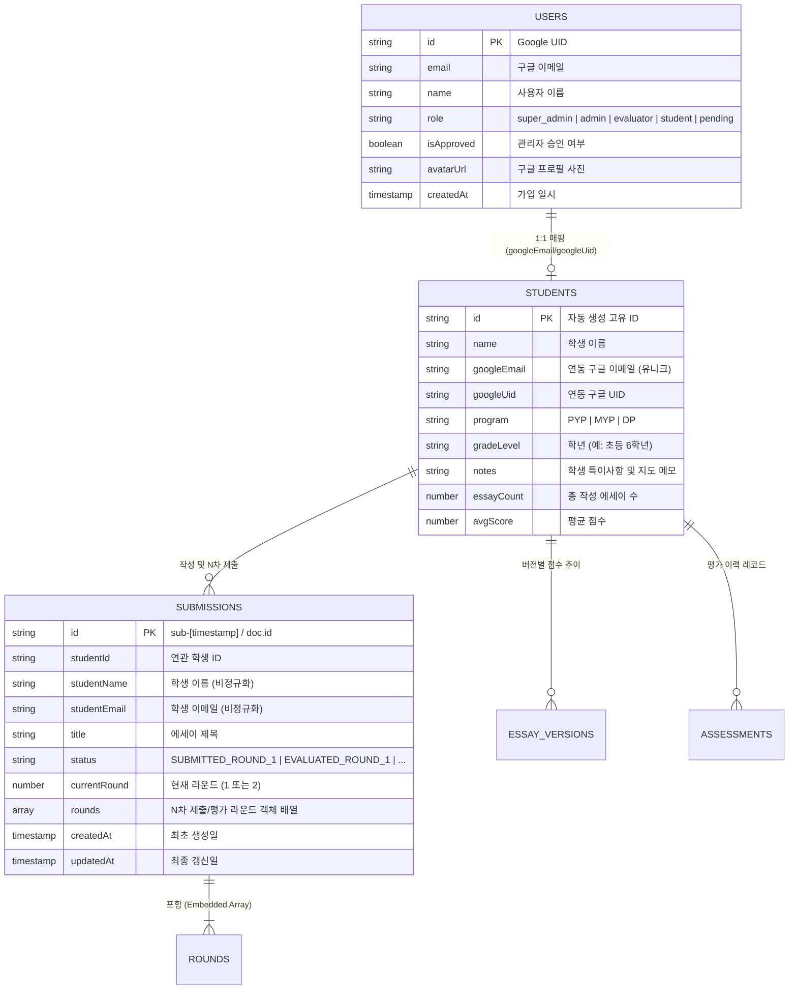

# 04. Firestore 데이터베이스 스키마 및 영구 데이터 모델
## (Firestore Database Schema & Data Models)

---

## 1. 개요 및 데이터 모델링 원칙

쭌이형제네 시스템의 NoSQL 데이터베이스(Cloud Firestore)는 **'학생 학습 이력의 영구 보존(Permanence)'**과 **'구글 인증 계정과 학생 프로필의 분리(Decoupling)'**를 대전제로 설계되었습니다.



---

## 2. 핵심 데이터 보존 철학

### 2.1 학생 글의 계정 독립적 영구 보존 원칙 (Decoupled Persistence)
* **원칙**: 구글 계정(`users`)과 학생 프로필/에세이(`students`, `submissions`)는 물리적으로 분리된 별도의 컬렉션으로 관리됩니다.
* **보장 사항**:
  1. 학생이 구글 계정을 탈퇴하거나, 권한이 변경되거나, 계정이 삭제되더라도 **기존에 작성하고 제출한 모든 에세이와 평가 기록은 절대로 함께 삭제되지 않습니다.**
  2. 에세이 레코드 자체에 `studentName`, `title`, `rounds` 데이터가 영구 보존되어 있어 향후 계정 재연결 또는 관리자 열람 시 완벽한 이력 추적이 가능합니다.

### 2.2 구글 계정당 1개 학생 프로필 보장 (1:1 Strict Mapping)
* `createStudent` 실행 시 `googleEmail` 중복 검증을 통과해야만 등록이 완료됩니다.
* 동일한 구글 이메일로 다수의 학생 프로필이 중복 생성되어 데이터가 분산되거나 꼬이는 현상을 원천 방지합니다.

---

## 3. 세부 Firestore 컬렉션 스키마 명세

### 3.1 `users` 컬렉션 (인증 및 역할 관리)
사용자가 Google OAuth로 로그인할 때 생성 및 갱신되는 계정 문서입니다.

| 필드명 | 타입 | 필수 | 설명 |
| :--- | :---: | :---: | :--- |
| `id` / `uid` | `string` | O | Firebase Auth 고유 식별자 (`auth.currentUser.uid`) |
| `email` | `string` | O | 사용자 Google 계정 이메일 |
| `name` | `string` | O | 사용자 표시 이름 (Display Name) |
| `role` | `string` | O | `'super_admin'` \| `'admin'` \| `'evaluator'` \| `'student'` \| `'pending'` |
| `isApproved` | `boolean` | O | 관리자 승인 상태 (`true`: 이용 가능, `false`: 승인 대기 화면 강제) |
| `avatarUrl` | `string` | X | Google 프로필 이미지 URL |
| `provider` | `string` | O | 인증 제공자 (`'google'`) |
| `createdAt` | `timestamp` | O | 계정 최초 가입 일시 |
| `approvedBy` | `string` | X | 승인 처리한 관리자 이메일 |
| `approvedAt` | `string` | X | 승인 처리 일시 (ISO 문자열) |

---

### 3.2 `students` 컬렉션 (가족 학생 프로필)
에세이를 작성하는 학생의 정체성을 정의하며 포트폴리오와 누적 성장의 기준 엔티티입니다.

| 필드명 | 타입 | 필수 | 설명 |
| :--- | :---: | :---: | :--- |
| `id` | `string` \| `number` | O | 학생 고유 식별자 (타임스탬프 또는 Firestore Doc ID) |
| `name` | `string` | O | 학생 실명 (예: "김준우", "김애진", "김도진") |
| `googleEmail` | `string` | X | 연동된 학생 Google 이메일 (학생 계정 자동 바인딩 기준) |
| `googleUid` | `string` | X | 연동된 학생 Google UID |
| `program` | `string` | O | 기본 소속 IB 프로그램 (`'PYP'` \| `'MYP'` \| `'DP'`) |
| `gradeLevel` | `string` | O | 학년 (예: "초등 6학년", "중등 2학년") |
| `notes` | `string` | X | 학생 특이사항 및 지도 조언 메모 |
| `essayCount` | `number` | O | 작성한 에세이 총 누적 건수 |
| `avgScore` | `number` \| `null`| X | IB 4대 기준 총점(32점 만점)의 누적 평균 점수 |
| `createdAt` | `timestamp` | O | 프로필 등록 일시 |

---

### 3.3 `submissions` 컬렉션 (에세이 제출 및 다면평가 워크플로)
학생의 에세이 작성, 1차 제출, 평가관의 채점 반환, 2차 퇴고 제출의 모든 사이클을 담는 핵심 컬렉션입니다.

| 필드명 | 타입 | 필수 | 설명 |
| :--- | :---: | :---: | :--- |
| `id` | `string` | O | 문서 식별자 (`sub-[timestamp]` 또는 Doc ID) |
| `studentId` | `string` \| `number` | O | 작성 학생 식별자 |
| `studentName` | `string` | O | 학생 이름 (조회 최적화를 위한 비정규화 저장) |
| `studentEmail` | `string` | X | 학생 구글 이메일 |
| `title` | `string` | O | 에세이 제목 |
| `program` | `string` | O | 제출 대상 IB 프로그램 (`'PYP'` \| `'MYP'` \| `'DP'`) |
| `gradeLevel` | `string` | O | 제출 당시 학년 |
| `guide` | `map` | O | 평가 루브릭 가이드 (`AssessmentGuide` 구조체) |
| `status` | `string` | O | 현재 진행 상태:<br>• `SUBMITTED_ROUND_1`: 1차 심사 대기<br>• `EVALUATED_ROUND_1`: 1차 평가 완료 (피드백 반환)<br>• `SUBMITTED_ROUND_2`: 2차 퇴고 심사 대기<br>• `EVALUATED_ROUND_2`: 2차 평가 완료 (최종 완료) |
| `currentRound` | `number` | O | 현재 활성 라운드 번호 (`1` 또는 `2`) |
| `rounds` | `array<map>` | O | N차별 제출 본문 및 평가 결과 객체 배열 (하단 참조) |
| `createdAt` | `string` (ISO) | O | 최초 생성 일시 |
| `updatedAt` | `string` (ISO) | O | 최종 상태 변경 일시 |

#### `rounds` 내부 요소 객체 (`EssaySubmissionRound`)
```typescript
interface EssaySubmissionRound {
  round: number;          // 1: 1차 초안, 2: 2차 퇴고본
  content: string;        // 학생이 작성한 실제 에세이 본문
  studentNotes?: string;  // 학생의 제출 메모 / 수정 이유
  submittedAt: string;    // 제출 시각 (ISO)
  isEvaluated: boolean;   // 평가관의 채점 완료 여부
  
  // 평가 완료 시 채워지는 필드 (미평가 시 null)
  result?: AssessmentResult | null; // 총점, 4대 기준 점수, 인라인 첨삭 등
  evaluatorNotes?: string;          // 평가관의 총평 및 지도 조언 요약
  evaluatorName?: string;           // 평가관 실명/닉네임
  evaluatedAt?: string;             // 평가 완료 시각 (ISO)
}
```

---

### 3.4 `essay_versions` 컬렉션 (퇴고 버전 히스토리)
포트폴리오 성장 추이 차트 및 버전 간 텍스트 비교를 위해 관리되는 스냅샷 컬렉션입니다.

| 필드명 | 타입 | 설명 |
| :--- | :---: | :--- |
| `id` | `string` \| `number` | 버전 식별자 |
| `studentName` | `string` | 학생 실명 |
| `essayTitle` | `string` | 에세이 제목 |
| `versionNumber`| `number` | 판본 번호 (1: 초안, 2: 1차 퇴고본...) |
| `versionLabel` | `string` | 판본 라벨 ("초안 (Draft)", "1차 퇴고본" 등) |
| `overallScore` | `number` | 총점 (0~32점) |
| `scoreA`~`scoreD`| `number` | IB 4대 기준별 점수 (각 1~8점) |
| `content` | `string` | 해당 버전의 에세이 본문 텍스트 |
| `changelog` | `string` | 이전 버전 대비 수정 요약 설명 |
| `createdAt` | `string` (ISO) | 버전 저장 일시 |

---

## 4. 데이터 안전성 및 정제 함수 (`sanitizeForFirestore`)

Firestore는 `undefined` 값을 저장할 수 없으며, 중첩된 객체 내 `undefined` 필드가 존재할 경우 런타임 오류(`FirebaseError: Function addDoc() called with invalid data. Unsupported field value: undefined`)를 발생시킵니다.

이를 방지하기 위해 `assessmentService.ts`에서는 전송 직전 재귀적 데이터 정제 필터를 적용합니다:

```typescript
function sanitizeForFirestore(obj: any): any {
  if (obj === undefined) return null;
  if (obj === null) return null;
  if (Array.isArray(obj)) {
    return obj.map(sanitizeForFirestore);
  }
  if (typeof obj === 'object') {
    const clean: any = {};
    for (const key of Object.keys(obj)) {
      const val = obj[key];
      if (val !== undefined) {
        clean[key] = sanitizeForFirestore(val);
      }
    }
    return clean;
  }
  return obj;
}
```

---

## 5. Firestore 보안 규칙 (`firestore.rules`)

현재 프로덕션 및 로컬 환경에서 원활한 연동을 보장하는 보안 규칙 명세입니다:

```javascript
rules_version = '2';
service cloud.firestore {
  match /databases/{database}/documents {
    // 1. 사용자 계정 프로필
    match /users/{userId} {
      allow read, write: if true;
    }
    
    // 2. 학생 프로필
    match /students/{studentId} {
      allow read, write: if true;
    }
    
    // 3. 에세이 평가 결과
    match /assessments/{assessmentId} {
      allow read, write: if true;
    }

    // 4. N차 퇴고 버전 관리
    match /essay_versions/{versionId} {
      allow read, write: if true;
    }

    // 5. 알림
    match /notifications/{notificationId} {
      allow read, write: if true;
    }

    // 6. 에세이 제출 및 다면평가 워크플로우 (신규)
    match /submissions/{submissionId} {
      allow read, write: if true;
    }
  }
}
```
